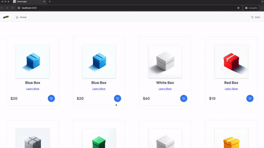

# headless-ecom
🛒 A headless, straightforward, and somewhat basic e-commerce platform developed to demonstrate several Golang patterns 🧩.

**🚧 Work in progress.**




**🔧 Install & run via docker-compose:**
```
git clone git@github.com:akolpakov-somehash/headless-ecom.git
docker-compose build
docker-compose up -d
```

**🌐 Visit:** http://localhost:4200/

**📋 Current functionality:**
- 👀 View products
- 🔍 View a single product
- 🛒 Add to cart
- 📦 Place an order

**⚠️ Please note:** Quotes and orders are memory-based and will not persist. They will be cleared once the service is restarted.

**🔗 Repos:**
- 🛍️ Sales Service (add to cart, place order, etc.): https://github.com/akolpakov-somehash/headless-ecom-sales-service
- 📖 Catalog Service (product details, list of products, etc.): https://github.com/akolpakov-somehash/headless-ecom-catalog-service
- 🌐 Webserver (handles REST API requests): https://github.com/akolpakov-somehash/headless-ecom-webserver
- 🖥️ Frontend (Angular based): https://github.com/akolpakov-somehash/headless-ecom-frontend